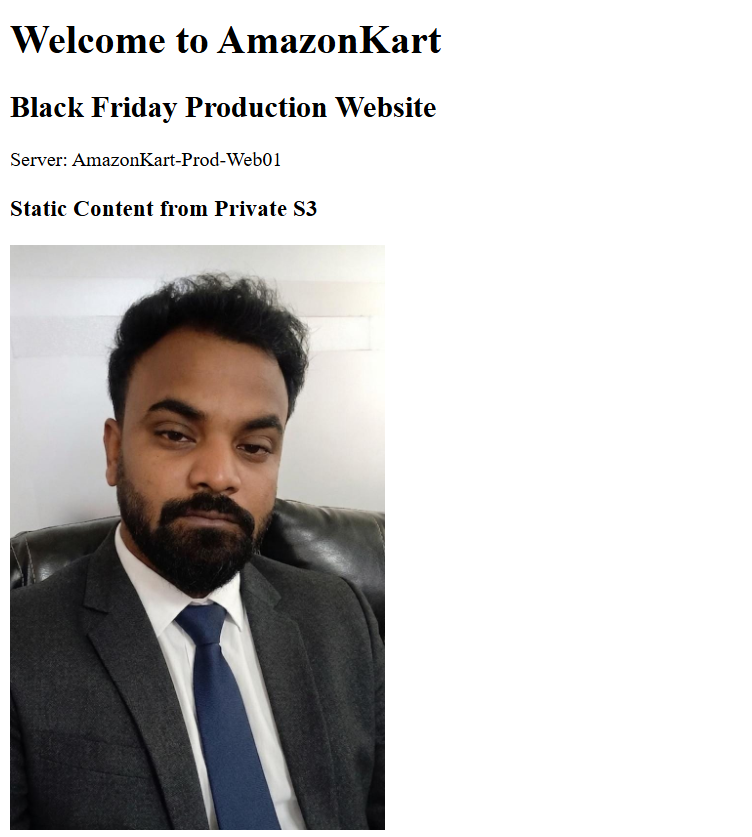
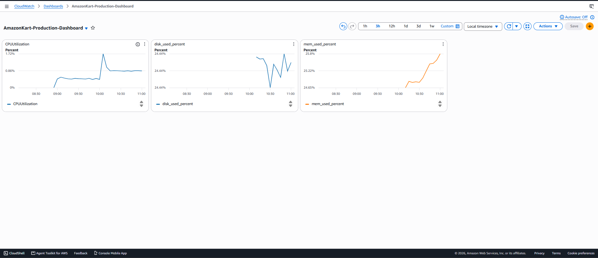
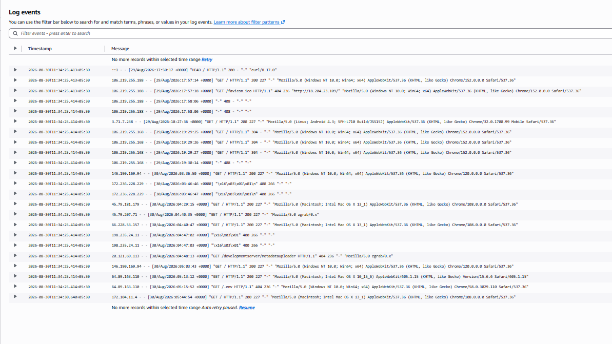
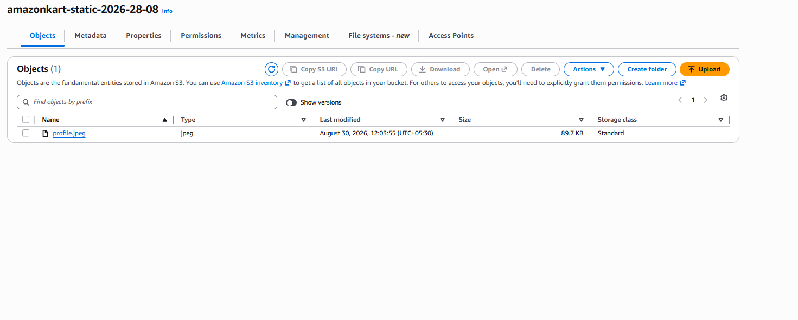
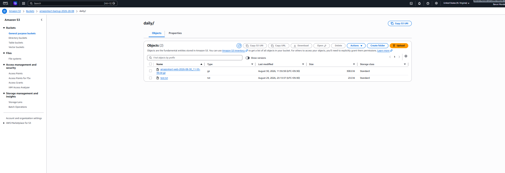
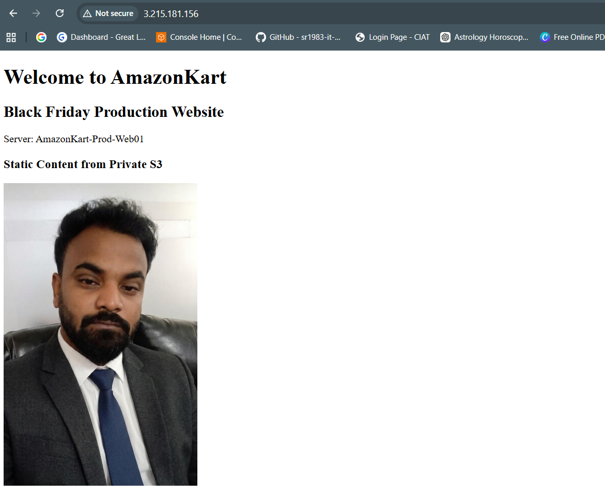

# AmazonKart Black Friday Infrastructure

### AWS DevOps & Site Reliability Engineering Project


A hands-on AWS infrastructure project designed around a **Black Friday production scenario**, focusing on security, monitoring, automation, centralized logging, backup, and disaster recovery.


The project was implemented under a restricted AWS service set to demonstrate how reliability and operational readiness can be improved even when services such as Auto Scaling, ALB, RDS, Route 53, and AWS Backup are unavailable.


---


## Project Objectives


- Build a custom AWS VPC architecture

- Deploy a production web server on Amazon EC2

- Apply network security using Security Groups and NACLs

- Implement least-privilege IAM access

- Store static content and backups securely in Amazon S3

- Monitor infrastructure using Amazon CloudWatch

- Collect centralized application and system logs

- Automate daily application backups

- Build and test a disaster recovery procedure

- Document operational and recovery procedures


---


## Architecture


```text

                        Internet

                           |

                    Internet Gateway

                           |

                +----------------------+

                |   AmazonKart VPC     |

                |    10.0.0.0/16      |

                +----------------------+

                     |            |

             Public Subnet    Private Subnet

             10.0.1.0/24     10.0.2.0/24

                  |             Isolated

                  |

            EC2 Web Server

             Apache HTTPD

                  |

         +--------+--------+

         |                 |

        S3             CloudWatch

  Static + Backup    Metrics + Logs

         |

    Daily Backup

    Bash + Cron


IAM  Least-Privilege Access


Disaster Recovery:

Golden AMI + S3 Backup → Recovery EC2 → Application Restore

```


---


## AWS Services Used


| Service | Purpose |

|---|---|

| Amazon EC2 | Production web server |

| Amazon VPC | Network isolation and routing |

| Amazon S3 | Static content and application backups |

| AWS IAM | Least-privilege access control |

| Amazon CloudWatch | Monitoring, alarms, dashboard and centralized logs |


---


## Network Design


Custom VPC:


```text

VPC CIDR: 10.0.0.0/16


Public Subnet:

10.0.1.0/24


Private Subnet:

10.0.2.0/24

```


The public subnet hosted the production EC2 web server.


The private subnet was intentionally kept isolated for the project design and did not host a workload.


An Internet Gateway and custom route table provided Internet connectivity to the public subnet.


---


## Security Implementation


Security controls included:


- SSH key-based authentication

- SSH password authentication disabled

- SSH restricted to a trusted source IP

- HTTP port 80 allowed for website access

- HTTPS port 443 permitted at the network layer

- Security Groups used as stateful firewall controls

- Network ACLs used as subnet-level controls

- S3 Block Public Access enabled for static content

- IAM least-privilege policies

- MFA configured for project IAM users

- EC2 Instance Metadata Service configured with IMDSv2


SSH verification:


```bash

sudo sshd -T | grep -E 'passwordauthentication|pubkeyauthentication'

```


Expected configuration:


```text

pubkeyauthentication yes

passwordauthentication no

```


---


## Production Web Server


The production application was hosted using:


```text

Amazon Linux 2023

Apache HTTP Server

Amazon EC2 t3.micro

```


Apache installation:


```bash

sudo dnf install -y httpd

sudo systemctl enable --now httpd

```


Application files:


```text

/var/www/html

```


Validation:


```bash

curl -I http://localhost

```


Expected result:


```text

HTTP/1.1 200 OK

```


---


## Private S3 Static Content


Static application content was stored in a private S3 bucket.


Public access to the bucket was blocked.


The EC2 instance retrieved required static objects using its IAM role:


```bash

sudo aws s3 cp \\

s3://amazonkart-static-2026-28-08/profile.jpeg \\

/var/www/html/static/profile.jpeg

```


The object was then served locally by Apache.


This allowed the S3 bucket itself to remain private.


---


## IAM Least-Privilege Design


Separate IAM groups were created for:


```text

Operations

Security

Audit

Intern

```


Permissions were assigned according to job responsibilities rather than providing AdministratorAccess to every user.


The production EC2 instance used:


```text

AmazonKart-EC2-Production-Role

```


The role provided controlled access to static content and backup storage.


---


## CloudWatch Monitoring


Infrastructure monitoring included:


- EC2 CPU utilization

- Memory utilization

- Root filesystem disk utilization

- CloudWatch Dashboard

- Threshold-based alarms


CloudWatch Agent was installed to collect operating-system-level metrics.


Custom namespace:


```text

AmazonKart/Production

```


Custom metrics:


```text

mem\_used\_percent

disk\_used\_percent

```


Alarm thresholds:


| Metric | Threshold |

|---|---:|

| CPU Utilization | > 75% |

| Memory Utilization | > 80% |

| Disk Utilization | > 85% |


> Note: The original challenge mentioned SNS email notification while also restricting the allowed AWS services. This implementation followed the strict service allow-list, so SNS notification actions were not configured.


---


## Centralized Logging


CloudWatch Logs collected:


```text

/var/log/httpd/access\_log

/var/log/httpd/error\_log

/var/log/secure

/var/log/messages

```


CloudWatch Log Groups:


```text

/amazonkart/production/apache/access

/amazonkart/production/apache/error

/amazonkart/production/auth

/amazonkart/production/system

```


This provided centralized visibility into web-server, authentication, and operating-system events.


---


## 💾 Automated Daily Backup


A Bash backup script archived:


```text

/var/www/html

```


and uploaded the archive to the private S3 backup bucket.


Example:


```bash

tar -czf "$FILE" "$SOURCE"


aws s3 cp "$FILE" \\

s3://amazonkart-backup-2026-28-08/daily/

```


Cron schedule:


```cron

0 0 * * * /usr/local/bin/amazonkart-backup.sh

```


This scheduled the application backup every day at midnight.


---


## Disaster Recovery


The disaster recovery strategy used:


```text

Production EC2

&#x20;     |

&#x20;     +----> Golden AMI

&#x20;     |

&#x20;     +----> Daily S3 Application Backup

```


Recovery procedure:


```text

Failure detected

&#x20;     ↓

Launch EC2 from Golden AMI

&#x20;     ↓

Verify Apache

&#x20;     ↓

Retrieve latest S3 backup

&#x20;     ↓

Restore /var/www/html

&#x20;     ↓

Validate application

```


Example restore:


```bash

aws s3 cp \\

s3://amazonkart-backup-2026-28-08/daily/<backup-file>.tar.gz \\

/tmp/


sudo tar -xzf /tmp/<backup-file>.tar.gz -C /var/www

```


Application validation:


```bash

curl -I http://localhost

curl -I http://localhost/static/profile.jpeg

```


---


## Disaster Recovery Test Result


A practical disaster recovery test was performed using the Golden AMI and S3 backup.


**Measured recovery time: approximately 3 minutes 9 seconds**


Target RTO:


```text

< 15 minutes

```


Result:


```text

RTO TEST: PASS ✅

```


---


## Troubleshooting Performed


Several real operational issues were encountered and resolved during implementation, including:


- SSH connectivity blocked by network rules

- Public IP changes after EC2 lifecycle operations

- NACL return-traffic requirements

- CloudWatch Agent configuration

- Missing AL2023 system log files before enabling rsyslog

- `crontab` unavailable until `cronie` installation

- S3 `AccessDenied` during DR restore due to missing `GetObject`

- Validation of Apache and static content after recovery


These troubleshooting exercises were an important part of the SRE-focused project.


---


## Repository Structure


```text

amazonkart-black-friday-infrastructure/

├── README.md

├── architecture/

│   └── architecture-diagram.png

├── cloudwatch/

│   └── amazon-cloudwatch-agent-config.json

├── documentation/

│   ├── final-project-documentation.pdf

│   └── implementation-runbook.pdf

├── screenshots/

│   ├── production-website.png

│   ├── cloudwatch-dashboard.png

│   ├── cloudwatch-logs.png

│   ├── s3-backup.png

│   └── dr-recovery.png

└── scripts/

&#x20;   └── amazonkart-backup.sh

```


---


## Architecture Constraints


This project intentionally followed the challenge's restricted AWS service list.


Therefore:


- No Application Load Balancer

- No Auto Scaling Group

- No RDS

- No Route 53

- No NAT Gateway

- No AWS Backup

- No Terraform/CloudFormation


As a result, the single production EC2 instance remains a **single point of failure**.


The project demonstrates **backup, monitoring, security and disaster recovery**, but it should not be interpreted as an automatically highly available architecture capable of independently proving support for 100,000 concurrent users.


For a real large-scale production environment, additional high-availability and scaling services would normally be required.


---


## Skills Demonstrated


`AWS` `EC2` `VPC` `S3` `IAM` `CloudWatch` `Linux` `Apache` `Bash` `Cron` `Networking` `Monitoring` `Logging` `Backup` `Disaster Recovery` `Incident Response` `DevOps` `SRE`


---


## Security Notice


No AWS access keys, secret keys, passwords, private SSH keys, or `.pem` files are stored in this repository.


Sensitive credentials should never be committed to source control.


---

## Project Evidence

### Production Website



### CloudWatch Monitoring Dashboard



### Centralized CloudWatch Logs



### Private S3 Static Content



### Automated S3 Backup



### Disaster Recovery Test



## Documentation


Detailed implementation steps, commands, troubleshooting notes, and disaster recovery procedures are available in the `documentation/` directory.


---


## Author


**Barun Mondal**


Cloud / DevOps / Site Reliability Engineering


